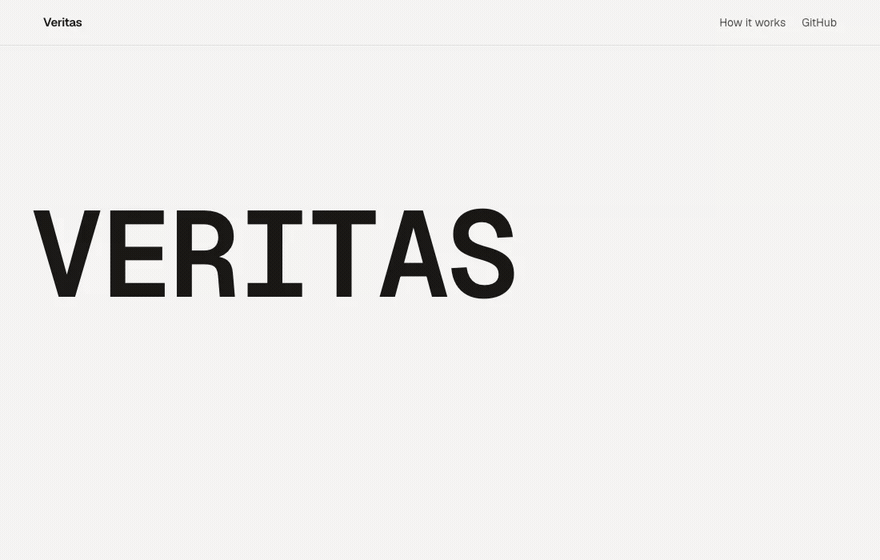
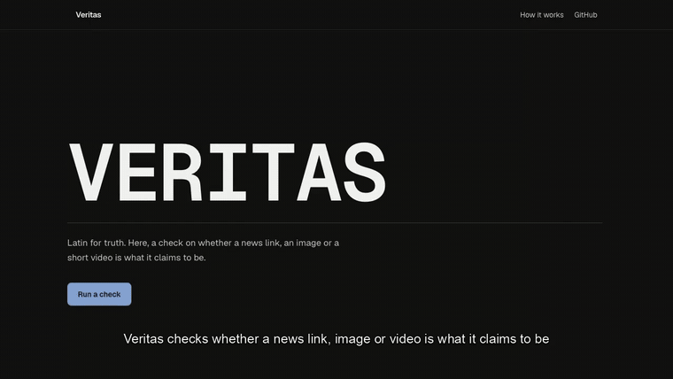
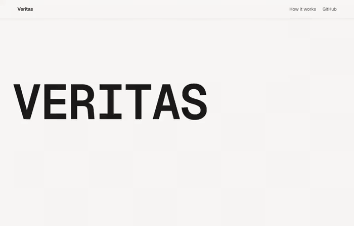
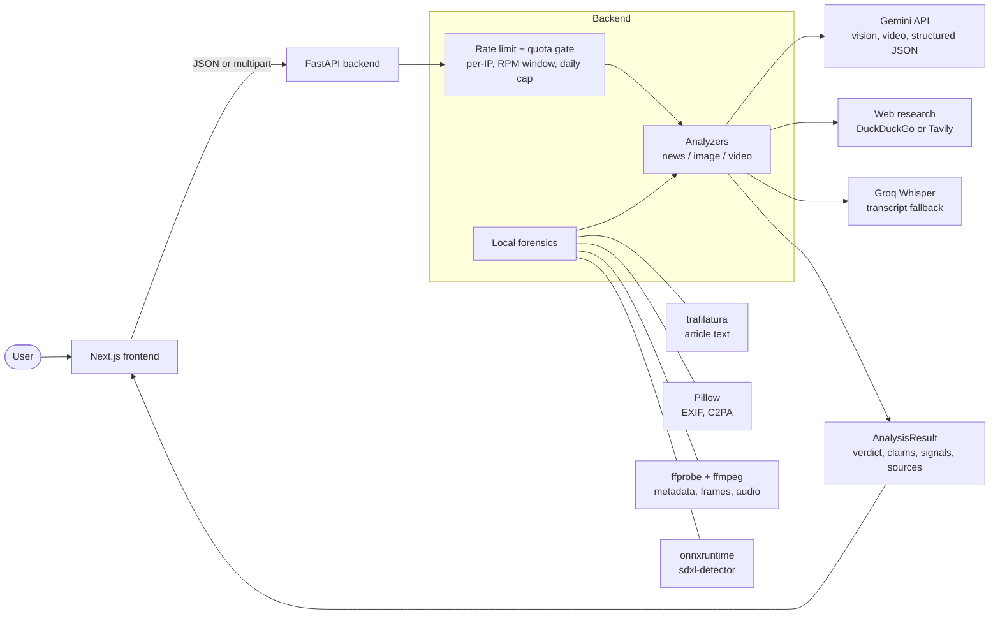
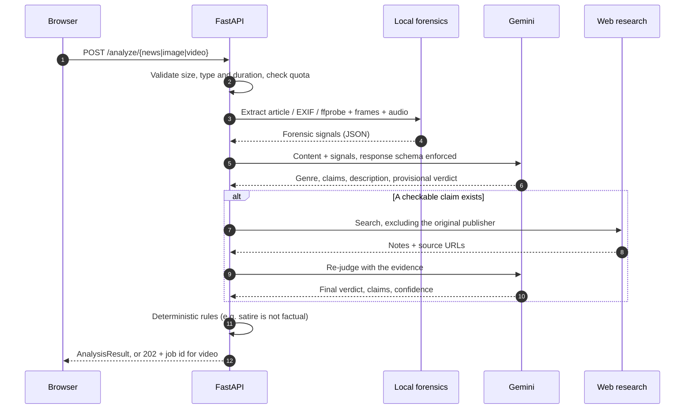

<div align="center">

# Veritas

**Is it real?** A multimodal misinformation checker for news links, images and short videos.
It returns a verdict, a calibrated confidence, the individual claims it checked, and the sources behind them.

**[Try it live](https://veritas-check.vercel.app)** · [Quick start](#quick-start) · [Architecture](#architecture) · [API](#api) · [Results](#results)

<sub>The backend runs on a free instance that sleeps when idle, so the first check of the day takes about a minute to wake.</sub>

</div>

<p align="center">
  
</p>

<p align="center">
  <a href="docs/assets/demo.mp4"></a><br>
  <a href="docs/assets/demo.mp4"><b>Watch the full demo</b></a> (30s, recorded against the live deployment)
</p>

---

## What it does

Paste a news URL, or upload an image or a short video. Veritas combines **local forensics**
(container metadata, EXIF, an ONNX AI-image detector, sampled frames and audio) with a
**hosted LLM that extracts and verifies the actual claims** against independent sources,
then shows its work: every signal, every source, and everything it could not verify.

| Input | What happens |
|---|---|
| **News URL** | Article is extracted, genre classified (hard news / satire / opinion / press release), 2-4 atomic claims pulled out and checked against sources that exclude the original publisher |
| **Image** | EXIF, PNG text chunks and C2PA markers read for camera or generator fingerprints; pixels scored by an ONNX detector; described, OCRed and artifact-checked; depicted events verified on the web |
| **Video** | ffprobe metadata (generator fingerprints, and YouTube re-encodes told apart from them), 8 frames scored by the detector, then the clip is analyzed with its audio: motion, lip sync, on-screen text and spoken claims |

**Version 2 runs no local deep-learning model.** No PyTorch, no transformers, no BERT.
The container is a few hundred MB and cold-starts in seconds, which is what makes it
deployable on free infrastructure.

<p align="center">
  
</p>

---

## Architecture



**Why this split:** the frontend is fully static, uploads go straight to the API
rather than through it, and the model keys never leave the backend.

## Execution flow



Video runs asynchronously: the client gets a `job_id` and polls `/jobs/{id}`, which reports
the live stage (`sampling frames`, `uploading`, `verifying claims on the web`).

---

## Quick start

### Prerequisites

| Requirement | Notes |
|---|---|
| Python 3.11+ | Backend |
| Node.js 20+ | Frontend |
| ffmpeg and ffprobe | `brew install ffmpeg` / `apt install ffmpeg`. Needed for video |
| Gemini API key | Free at [aistudio.google.com/apikey](https://aistudio.google.com/apikey) |
| Groq API key (optional) | Free at [console.groq.com/keys](https://console.groq.com/keys). Whisper transcript fallback |
| Tavily API key (optional) | Free at [app.tavily.com](https://app.tavily.com). Faster, more reliable search than the default |

### 1. Clone and configure

```bash
git clone https://github.com/muditagrawal-alt/Deepfake-and-Fake-News-Detector.git
cd Deepfake-and-Fake-News-Detector
cp backend/.env.example .env
```

Open `.env` and fill in at least `GEMINI_API_KEY`. The file is git-ignored.

```ini
GEMINI_API_KEY=your-key-here
GROQ_API_KEY=
TAVILY_API_KEY=
```

### 2. Backend

```bash
cd backend
python3 -m venv .venv && source .venv/bin/activate
pip install -r requirements.txt
uvicorn detector.main:app --reload --port 7860
```

First run downloads the 354 MB ONNX detector into `backend/models/`. Verify:

```bash
curl -s localhost:7860/health
```

### 3. Frontend

```bash
cd frontend
npm install
npm run dev
```

Open <http://localhost:3000>. `frontend/.env.local` points at `http://localhost:7860` by default.

### Command line, without the UI

```bash
cd backend && source .venv/bin/activate
python -m scripts.list_models                       # Gemini model ids your key can call
python -m scripts.smoke --url https://example.com/article
python -m scripts.smoke --image path/to/photo.jpg
python -m scripts.smoke --video path/to/clip.mp4
```

### Reproduce the benchmarks

```bash
python -m eval.run_eval --modality news     # also: image, video
```

Writes `data/evaluation/<set>/results_v2.csv` and `metrics_v2.txt`.

---

## API

Base URL is the backend origin (`https://veritas-api-ahjc.onrender.com` for the live
deployment). All responses are JSON.

| Method | Endpoint | Body | Returns |
|---|---|---|---|
| `GET` | `/health` | | Provider status, model ids, remaining quota |
| `POST` | `/analyze/news` | `{"url": "..."}` | `AnalysisResult` |
| `POST` | `/analyze/image` | multipart `file` | `AnalysisResult` |
| `POST` | `/analyze/video` | multipart `file` | `202 {"job_id"}` |
| `GET` | `/jobs/{job_id}` | | `{status, stage, result}` |

<details>
<summary><code>AnalysisResult</code> shape</summary>

```jsonc
{
  "verdict": "LIKELY_REAL | LIKELY_FAKE | UNCERTAIN",
  "confidence": 0.92,
  "summary": "One or two plain sentences.",
  "reasoning": "How the evidence was weighed.",
  "genre": "satire",
  "claims": [{
    "claim": "...",
    "status": "corroborated | contradicted | misleading | unverifiable",
    "explanation": "...",
    "sources": [{"title": "...", "url": "..."}]
  }],
  "signals": [{"name": "generator_metadata", "value": "encoder: Google",
               "direction": "fake", "weight": "strong", "note": "..."}],
  "caveats": ["What could not be verified."],
  "evidence": [{"title": "...", "url": "..."}],
  "forensics": { "metadata": {}, "frame_detector": {} },
  "provenance": {"model": "gemini-3.5-flash-lite", "grounded": false,
                 "research_provider": "duckduckgo"}
}
```
</details>

```bash
curl -s -X POST localhost:7860/analyze/news \
  -H 'content-type: application/json' \
  -d '{"url":"https://www.theonion.com/report-nation-somehow-more-divided-than-ever-before-1849972712"}'
```

---

## Results

Measured on the same 130-item benchmark used for v1, which ran BERT and PyTorch locally.
Per-item outputs are in `data/evaluation/<set>/results_v2.csv`.

| Set | v1 | v2 | Change |
|---|---|---|---|
| News (50) | 0.86 | **0.92** | v1 called 7 real articles fake. v2 calls none; fake-precision 1.00, F1 0.98 |
| Images (50) | 0.86 | **0.94** | v1 needed a calibrator fit on the test set. v2 uses none |
| Videos (30) | 1.00 | **1.00** | v1 relied on generator metadata tags. v2 also watches frames and audio, minimum confidence 0.75 |

The video set is the weakest evidence in this table: its fakes all carry intact generator
metadata, which real-world uploads usually lose to re-encoding.

**On the pixel detector.** The bundled `sdxl-detector` is **off by default**. Measured
against these same sets, enabling it *lowers* image accuracy (0.94 to 0.88) and leaves
video unchanged at 1.00: on its own it scores 0.66 and systematically over-calls real
photographs of people, which drags the final judgement with it. It also needs about
500 MB resident, so leaving it off is what lets the service run on a small instance.
Set `ENABLE_ONNX_DETECTOR=true` to weigh it in anyway.

---

## Project structure

```
backend/
  detector/
    main.py              FastAPI app, endpoints, limits
    pipeline.py          Dispatcher and legacy-compatible entry point
    config.py            Settings from .env
    quota.py             Concurrency, RPM window, daily cap
    analyzers/           news.py, image.py, video.py, prompts.py
    forensics/           article, exif, video_meta, frames, onnx_detector
    providers/           gemini, groq, research, openai_compat
  eval/run_eval.py       Benchmark runner
  Dockerfile             Space image
frontend/                Next.js app (App Router, Tailwind v4, Motion)
data/evaluation/         Benchmark sets and results
paper/                   Figure generation for the write-up
```

---

## Limitations

- Verdicts are probabilistic estimates from a language model plus heuristics. They are **signals, not proof**.
- Metadata is trivially stripped or forged. Its absence is treated as neutral; a generator name in it is strong but not conclusive evidence.
- The pixel detector was trained on SDXL-era images. It over-calls real photos of people and struggles with thumbnails, so it is weighted accordingly rather than trusted.
- Paywalled or bot-blocked articles fall back to URL-based checks, which lowers confidence.
- Free-tier model providers may use submitted content to improve their services. Do not submit private material.

## License and credits

Code in this repository is released under the MIT License. The bundled detector,
[`Organika/sdxl-detector`](https://huggingface.co/Organika/sdxl-detector), is **CC-BY-NC-3.0**,
so any deployment of this project as a whole must remain non-commercial.

Background music in the demo: **"Art Of Silence V2"** by Uniq, licensed
[CC BY 4.0](https://creativecommons.org/licenses/by/4.0), via
[Wikimedia Commons](https://commons.wikimedia.org/wiki/File:Uniq_-_Art_Of_Silence_V2.ogg).
The excerpt used is `docs/assets/music.mp3`.

Built by [Mudit Agrawal](https://github.com/muditagrawal-alt) as a Semester-6 major project.
